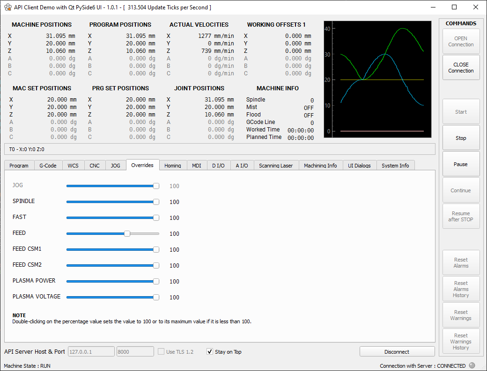

# RosettaCNC API Client Core

Python and C++ clients for accessing the RosettaCNC API Server through JSON
requests and responses over TCP/IP sockets.

API version 1.5.3 is paired with RosettaCNC Control Software 14.4.4.

## Documentation

The complete protocol documentation is available in the `documents` directory:

- [RosettaCNC API Server manual](documents/nc00006_it-manuale-server-api.pdf)

The following list is a concise API index. Refer to the PDF manual for
parameters, payloads, responses, and command behavior.

## Available APIs

### Connection

- `connect`, `connect_direct`, `close`, `is_connected`
- `connection_clone`, `connection_host`, `connection_port`, `connection_use_ssl`
- `socket_ssl_info`, `get_last_response`

### Read: CNC and system status

- `get_axes_info`, `get_cnc_info`, `get_compile_info`, `get_enabled_commands`
- `get_machine_settings`, `get_machining_info`, `get_runtime_data`, `get_system_info`
- `get_coordinate_systems_info`, `get_localization_info`, `get_scanning_laser_info`
- `get_work_info`, `get_operator_request`

### Read: alarms, warnings, and I/O

- `get_alarms_current_list`, `get_alarms_history_list`
- `get_warnings_current_list`, `get_warnings_history_list`
- `get_analog_inputs`, `get_analog_outputs`
- `get_digital_inputs`, `get_digital_outputs`
- `get_cnc_parameters`

### Read: programs and simulation

- `get_program_info`, `get_programmed_points`, `get_mru_programs_list`
- `get_compiler_settings`, `get_simulator_data`, `get_toolpath_data`

### Read: tools and virtual-machine geometry

- `get_tools_lib_count`, `get_tools_lib_info`, `get_tools_lib_infos`
- `get_tools_lib_tool_index_from_id`, `get_vm_geometry_info`

### Read: work orders

- `get_work_order_code_list`, `get_work_order_data`, `get_work_order_file_list`

### Write: configuration and coordinates

- `set_compiler_settings`, `set_cnc_parameters`, `set_kinematics`, `set_localization`
- `set_dynamic_offset_x`, `set_dynamic_offset_y`, `set_dynamic_offset_z`
- `set_dynamic_offsets`, `set_wcs_info`, `set_vm_geometry_info`
- `set_operator_response`

### Write: overrides

- `set_override_fast`, `set_override_feed`, `set_override_jog`
- `set_override_feed_custom_1`, `set_override_feed_custom_2`
- `set_override_plasma_power`, `set_override_plasma_voltage`
- `set_override_spindle`

### Write: program position and simulator

- `set_program_position_a`, `set_program_position_b`, `set_program_position_c`
- `set_program_position_x`, `set_program_position_y`, `set_program_position_z`
- `set_program_position_x_with_laser_reference`
- `set_program_position_y_with_laser_reference`
- `set_program_position_z_with_laser_reference`
- `set_simulator_current_time_ms`, `set_simulator_speed_track`

### Write: tools and work orders

- `set_tools_lib_info`, `set_work_order_data`

### CNC commands

- `cnc_change_function_state_mode`, `cnc_connection_close`, `cnc_connection_open`
- `cnc_continue`, `cnc_homing`, `cnc_jog_command`, `cnc_mdi_command`, `cnc_pause`
- `cnc_resume`, `cnc_resume_from_line`, `cnc_resume_from_point`
- `cnc_start`, `cnc_start_from_line`, `cnc_start_from_point`, `cnc_stop`

### File and program commands

- `file_export_cpf`, `file_export_csf`, `file_export_ctf`, `file_export_msg`, `file_export_psf`
- `file_import_cpf`, `file_import_csf`, `file_import_ctf`, `file_import_msg`, `file_import_psf`
- `program_analysis`, `program_analysis_abort`
- `program_gcode_add_text`, `program_gcode_clear`, `program_gcode_modified`
- `program_gcode_set_text`, `program_load`, `program_new`, `program_save`, `program_save_as`
- `mru_programs_list_clear`, `mru_programs_list_remove_item`, `log_add`

### Reset and user-interface commands

- `reset_alarms`, `reset_alarms_history`
- `reset_warnings`, `reset_warnings_history`
- `show_ui_dialog`

### Simulator commands

- `simulator_continue`, `simulator_pause`, `simulator_place_and_pause_to_line`
- `simulator_start`, `simulator_step_backward`, `simulator_step_forward`, `simulator_stop`

### Tool and work-order commands

- `tools_lib_add`, `tools_lib_clear`, `tools_lib_delete`, `tools_lib_insert`
- `work_order_add`, `work_order_delete`

### Threaded convenience methods

- `cnc_resume_threaded`, `cnc_resume_from_line_threaded`, `cnc_resume_from_point_threaded`
- `cnc_start_threaded`, `cnc_start_from_line_threaded`, `cnc_start_from_point_threaded`
- `program_analysis_threaded`, `program_load_threaded`
- `program_save_threaded`, `program_save_as_threaded`

### Utility

- `create_compact_json_request`, `datetime_to_filetime`

## Python Qt/PySide6 example

