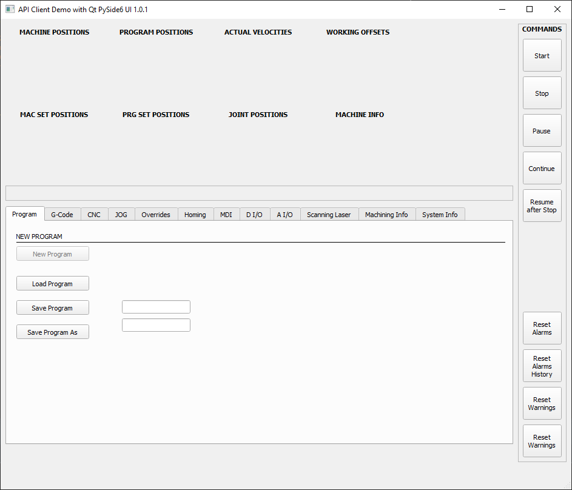

# cnc_api_client_core_1
The RosettaCNC numerical control has an API Server with which to access its internal functionality via JSON 
Requests/Responses over TCP/IP sockets. Versions of a Client API for various programming languages will 
be available in this repository.

# Examples
---
## Python with QT PySide6
NOTE: this is an early implemenation yet!
