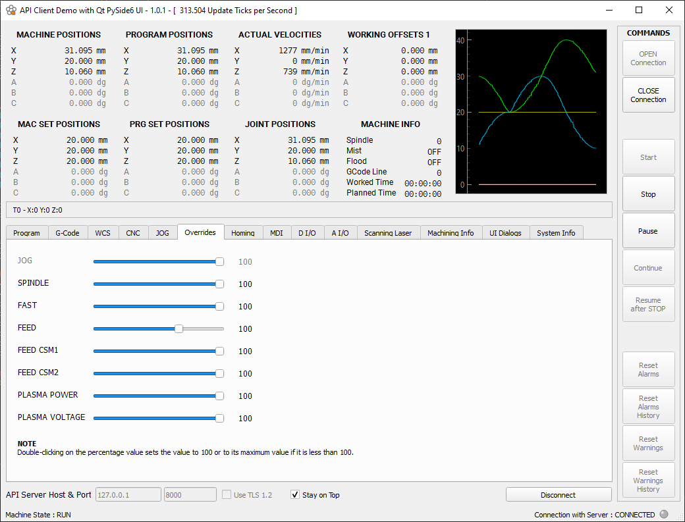

# CNC API Client — Python Qt PySide6 Demo

A fully functional example of a **CNC operator UI client** built with Python and Qt PySide6,
communicating with the [RosettaCNC](https://www.rosettacnc.com) API Server over TCP/IP.

This project is intended as a **reference implementation** for developers who want to build
their own custom UI for the RosettaCNC numerical control system.



---

## Overview

The RosettaCNC API Server exposes CNC internals via **JSON Requests/Responses over TCP/IP sockets**.
This client connects to that server and provides:

- Real-time CNC status display (state machine, axes, overrides, spindle, etc.)
- MDI command input
- G-code program load/save and display with syntax highlighting
- Real-time scope / signal monitor
- **Operator Request dialogs** triggered by CNC G-code commands (`M109`, `M120`)

---

## Operator Request Dialogs

The most distinctive feature of this demo is the operator request system.
When the CNC executes specific G-code commands, it pauses and requests input from the UI operator.

### M109 — User Message Dialog

Displays a text message and optionally collects numeric values from the operator.

```gcode
; ask operator to confirm with a simple message
M109 P"Please check tool before continuing"

; ask operator to enter a value
M109 P"Enter offset value" Q101 R1
```

### M120 — User Media Dialog

Like M109, but displays **rich media content** (image or Lottie animation) alongside
the message and input fields. The media visually explains what the operator is expected to do.

```gcode
; set default values for the 3 input fields
G10 L100 P5730 V1.1
G10 L100 P5731 V2.2
G10 L100 P5732 V3.3

; show dialog with Lottie animation and 3 editable fields
M120 P"about.lottie" Q100 R3
```

The CNC reads the media file from its own storage, encodes it as base64 and sends it
to the client via the API. The client decodes and renders it automatically.

#### Supported media types

| MIME type | Format | Renderer |
|---|---|---|
| `image/png`, `image/jpeg`, `image/bmp`, ... | Static image | `QPixmap` / `QLabel` |
| `image/gif` | Animated GIF | `QMovie` |
| `image/svg+xml` | Vector image | `QPixmap` |
| `video/lottie+json` | Lottie animation | `LottieWidget` (see below) |

---

## Lottie Animation Support

PySide6 does not natively support Lottie animations. This demo implements `LottieWidget`,
a custom widget that renders Lottie JSON animations using `QWebEngineView` and the
[lottie-web](https://github.com/airbnb/lottie-web) JavaScript player — **fully offline**,
no internet connection required.

### How it works

1. The CNC sends the Lottie JSON file content encoded as base64 in the data URI:
   ```
   data:video/lottie+json;base64,<base64-encoded-json>
   ```
2. The client decodes the base64 back to bytes.
3. `LottieWidget` reads the original animation dimensions (`w`, `h`) directly from the JSON.
4. The JSON is embedded inline into an HTML page together with `lottie.min.js`.
5. `QWebEngineView` renders the HTML page — the animation plays inside the dialog.

### Included lottie-web player versions

Two versions of the lottie-web player are included in the repository.
No internet connection is needed — both files are bundled locally:

| File | Version | Notes |
|---|---|---|
| `lottie.min.5.12.2.js` | 5.12.2 | Tested and stable — **recommended** |
| `lottie.min.5.13.0.js` | 5.13.0 | Latest available |

The active version is selected in `lottie_widget.py`. To switch version, change:

```python
LOTTIE_JS = Path(__file__).parent / "lottie.min.5.12.2.js"
```

### LottieWidget API

```python
from lottie_widget import LottieWidget

widget = LottieWidget(
    lottie_bytes,                    # bytes: Lottie JSON content
    js_path="lottie.min.5.12.2.js",
    inline_js=True,                  # embed JS into HTML (recommended, always works offline)
    background="transparent",        # CSS color for background
    loop=True,
    autoplay=True,
    renderer="svg",                  # "svg" | "canvas" | "html"
)

# runtime control
widget.play()
widget.pause()
widget.stop()
widget.set_speed(1.5)               # 1.5x speed
widget.set_direction(forward=False) # play in reverse
```

### QWebEngineView warm-up

The first time `QWebEngineView` is instantiated, the Chromium renderer process starts,
which takes approximately **1 second**. Subsequent uses are immediate.

To avoid this delay being noticeable to the operator, call the warm-up helper
**once at application startup**, right after `QApplication()`:

```python
app = QApplication(sys.argv)

# pre-initialize Chromium renderer — keep reference alive for the app lifetime
from lottie_widget import warmup_webengine
_webengine_warmup = warmup_webengine()

# ... rest of application initialization
```

> **Important:** keep the reference returned by `warmup_webengine()` alive
> for the entire application lifetime, or the warm-up effect is lost.

---

## Operator Request — Implementation Notes

### Efficient polling

The desktop view polls the API Server every millisecond via `QTimer` to check for
pending operator requests. The key design principle is:

> **Never re-download the full media payload on every tick.**

The `cnc_info` response includes an `operator_request_id_pending` field (a GUID).
The check logic uses this GUID to decide whether to fetch the full request payload:

```python
def __operator_request_check(self):

    # no pending request -> close any active dialog
    if not cnc_info.operator_request_id_pending:
        kill_active_operator_request()
        return

    # same request already being handled -> nothing to do
    if (self.active_operator_request is not None and
            self.active_operator_request.id == cnc_info.operator_request_id_pending):
        return

    # new request -> download full payload (including media) only now
    operator_request = self.api.get_operator_request()
    ...
```

This ensures that a large Lottie JSON payload (potentially hundreds of KB encoded in base64)
is downloaded **only once per operator request**, not thousands of times per second.

### Media type detection

The media field uses standard data URI format. Detection uses a regex that correctly
handles composite MIME subtypes like `lottie+json`:

```python
match_image = re.match(r"data:image/(\w+);base64,(.*)", media)
match_video = re.match(r"data:video/([^;]+);base64,(.*)", media)
#                                    ^^^^^^
#                       [^;]+ correctly matches "lottie+json"
#                       \w+  would fail (+ is not a word character)
```

---

## Requirements

- Python 3.11+
- PySide6
- PySide6-WebEngine (for Lottie animation support)

```bash
pip install PySide6 PySide6-WebEngine
```

---

## Project Structure

```
api_client_qt_demo/
├── api_client_qt_demo.py               # application entry point
├── api_client_qt_demo_desktop_view.py  # main window
├── cnc_api_client_core.py              # CNC API client (TCP/IP, JSON protocol)
├── cnc_memento.py                      # settings persistence
├── lottie_widget.py                    # LottieWidget + warmup_webengine()
├── qt_gcode_highlighter.py             # G-code syntax highlighter
├── qt_realtime_scope.py                # real-time signal scope widget
├── qt_user_dialogs.py                  # UserMediaDialog + UserMessageDialog
├── qt_utils.py                         # Qt utility helpers
├── utils.py                            # general utility helpers
├── lottie.min.5.12.2.js                # lottie-web player (stable, recommended)
├── lottie.min.5.13.0.js                # lottie-web player (latest)
├── ui_desktop_view.py                  # Qt Designer generated UI
├── ui_user_media_dialog.py             # Qt Designer generated UI
├── ui_user_message_dialog.py           # Qt Designer generated UI
└── images/
    └── preview.png
```

---

## Connection

The client connects to the RosettaCNC API Server via TCP/IP (plain or TLS).
Host, port and TLS settings are persisted in a local settings file and can be
configured from the application UI.

Default connection parameters:

| Parameter | Default |
|---|---|
| Host | `192.168.0.220` |
| Port | `8888` |
| TLS | disabled |

---

## License

RosettaCNC License 1.0 (RCNC-1.0)
Copyright (c) 2016-2026 RosettaCNC

The lottie-web player (`lottie.min.*.js`) is distributed under the
[MIT License](https://github.com/airbnb/lottie-web/blob/master/LICENSE.md)
— Copyright (c) Airbnb.

---

## Links

- [RosettaCNC](https://www.rosettacnc.com)
- [lottie-web on GitHub](https://github.com/airbnb/lottie-web)
- [PySide6 documentation](https://doc.qt.io/qtforpython-6/)
- [Lottie file format specification](https://lottie.github.io/lottie-spec/)
